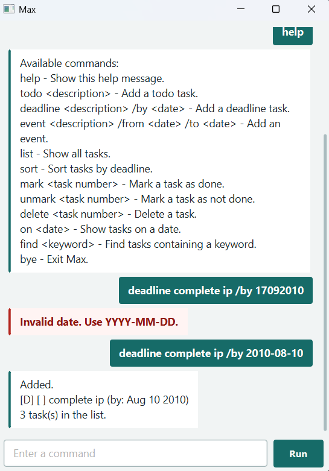

# Max User Guide



Max is a task-management application for keeping track of todos, deadlines, and
events. Tasks are saved automatically, so they are available the next time Max
is started.


## Getting started

### Prerequisites

- java 25

To run Max:

1. Install the jar file [here](https://github.com/KeeYenCheng/ip/releases/tag/Version1.0)
2. you could double click on the jar file to run it or run it using the command prompt
   ```bash
   java -jar max.jar
   ```
## Using Max

Enter commands in the input box and submit them. Dates must use the
`yyyy-MM-dd` format, for example `2026-09-17`. Task numbers start at 1 and are
shown in the task list.

### Complete command reference

The following table lists every command supported by Max. Replace values in
`UPPERCASE` with your own input.

| Command | Description | Example |
| --- | --- | --- |
| `todo DESCRIPTION` | Adds a task without a date. | `todo Read chapter 3` |
| `deadline DESCRIPTION /by DATE` | Adds a task with a due date. | `deadline Submit report /by 2026-09-20` |
| `event DESCRIPTION /from DATE /to DATE` | Adds an event spanning a date range. | `event Project meeting /from 2026-09-18 /to 2026-09-18` |
| `list` | Displays all tasks. | `list` |
| `sort` | Sorts deadline tasks from earliest to latest, keeping tasks without deadlines after them. | `sort` |
| `on DATE` | Shows deadlines due on the date and events that include the date. | `on 2026-09-18` |
| `find KEYWORD` | Finds tasks whose descriptions contain the keyword. | `find report` |
| `mark NUMBER` | Marks a task as done. | `mark 1` |
| `unmark NUMBER` | Marks a task as not done. | `unmark 1` |
| `delete NUMBER` | Deletes a task. | `delete 1` |
| `help` | Displays the complete command list. | `help` |
| `bye` | Saves the task list and exits Max. | `bye` |

For `mark`, `unmark`, and `delete`, use the task number shown by `list`.

### Command details

#### `find`

Use `find KEYWORD` to search task descriptions. Max displays all matching
tasks, or `No matching tasks.` when there are no matches.

```text
find report
```

#### `mark` and `unmark`

Use `mark NUMBER` to complete a task. Use `unmark NUMBER` to change it back to
not done.

```text
mark 1
unmark 1
```

#### `on`

Use `on DATE` to view deadlines on a specific date and events that occur
within that date range.

```text
on 2026-09-18
```

#### `help`

Use `help` at any time to display the available commands and their syntax.

```text
help
```

Use `bye` to close Max. The task list is saved automatically after each
successful command in `src/data/Max.txt`.

## Example session

```text
todo Read chapter 3
deadline Submit report /by 2026-09-20
list
mark 1
find report
bye
```
- Keep Java source files under `src/main/java` and resources under
  `src/main/resources`, as expected by Gradle.
